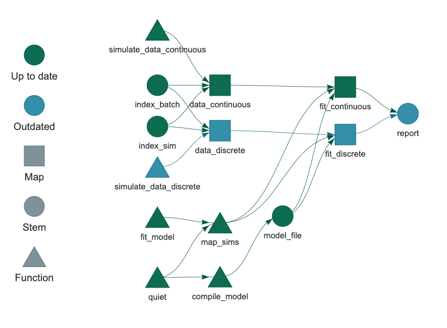

# `targets` R package Stan model example

[](https://rstudio.cloud/project/1430719/)

The goal of this workflow is to validate a small Bayesian model.

``` r
y_i ~ iid Normal(alpha + x_i * beta, sigma^2)
alpha ~ Normal(0, 1)
beta ~ Normal(0, 1)
sigma ~ HalfCauchy(0, 1)
```

We simulate multiple datasets from the model and fit the model on each
dataset. For each model fit, we determine if the 50% credible interval
of the regression coefficient `beta` contains the true value of `beta`
used to generate the data. If we implemented the model correctly,
roughly 50% of the models should recapture the true `beta` in 50%
credible intervals.

## The `targets` pipeline

The [`targets`](https://github.com/wlandau/targets) R package manages
the workflow. It automatically skips steps of the pipeline when the
results are already up to date, which is critical for Bayesian data
analysis because it usually takes a long time to run Markov chain Monte
Carlo. It also helps users understand and communicate this work with
tools like the interactive dependency graph below.

``` r
library(targets)
tar_visnetwork()
```



## File structure

The files in this example are organized as follows.

``` r
├── run.sh
├── run.R
├── _targets.R
├── _targets/
├── sge.tmpl
├── R
│   ├── functions.R
│   └── utils.R
├── stan
│   └── model.stan
└── report.Rmd
```

| File                                                                                   | Purpose                                                                                                                                                                                                                                                                                                                                                                                                     |
| -------------------------------------------------------------------------------------- | ----------------------------------------------------------------------------------------------------------------------------------------------------------------------------------------------------------------------------------------------------------------------------------------------------------------------------------------------------------------------------------------------------------- |
| [`run.sh`](https://github.com/wlandau/targets-stan/blob/main/run.sh)                   | Shell script to run [`run.R`](https://github.com/wlandau/targets-stan/blob/main/run.R) in a persistent background process. Works on Unix-like systems. Helpful for long computations on servers.                                                                                                                                                                                                            |
| [`run.R`](https://github.com/wlandau/targets-stan/blob/main/run.R)                     | R script to run `tar_make()` or `tar_make_clustermq()` (uncomment the function of your choice.)                                                                                                                                                                                                                                                                                                             |
| [`_targets.R`](https://github.com/wlandau/targets-stan/blob/main/_targets.R)           | The special R script that declares the [`targets`](https://github.com/wlandau/targets) pipeline. See `tar_script()` for details.                                                                                                                                                                                                                                                                            |
| [`sge.tmpl`](https://github.com/wlandau/targets-stan/blob/main/sge.tmpl)               | A [`clustermq`](https://github.com/mschubert/clustermq) template file to deploy targets in parallel to a Sun Grid Engine cluster. The comments in this file explain some of the choices behind the pipeline construction and arguments to `tar_target()`.                                                                                                                                                   |
| [`R/functions.R`](https://github.com/wlandau/targets-stan/blob/main/R/functions.R)     | A custom R script with the most important user-defined functions.                                                                                                                                                                                                                                                                                                                                           |
| [`R/utils.R`](https://github.com/wlandau/targets-stan/blob/main/R/functions.R)         | A custom R script with helper functions.                                                                                                                                                                                                                                                                                                                                                                    |
| [`stan/model.stan`](https://github.com/wlandau/targets-stan/blob/main/stan/model.stan) | The specification of our Stan model.                                                                                                                                                                                                                                                                                                                                                                        |
| [`report.Rmd`](https://github.com/wlandau/targets-stan/blob/main/report.Rmd)           | An R Markdown report summarizing the results of the analysis. For more information on how to include R Markdown reports as reproducible components of the pipeline, see the `tar_render()` function from the [`tarchetypes`](https://wlandau.github.io/tarchetypes) package and the [literate programming chapter of the manual](https://wlandau.github.io/targets-manual/files.html#literate-programming). |

## How to access

This project has an [RStudio
Cloud](https://rstudio.cloud/project/1430719/) workspace that lets you
try out the example code in the cloud with only a web browser and an
internet connection. Unfortunately, as [explained
here](https://community.rstudio.com/t/stan-on-rstudio-cloud-not-working/49224/3),
`rstan` cannot currently compile models in RStudio Cloud because it hits
the 1 GB memory limit. The Stan maintainers will likely fix this at some
point.

## How to run

1.  If you are running locally instead of [this RStudio cloud
    workspace](https://rstudio.cloud/project/1430691)
    1.  Install the [`targets`](https://github.com/wlandau/targets)
        package, as well as the packages listed in the
        `tar_option_set()` call in
        [`_targets.R`](https://github.com/wlandau/targets-stan/blob/main/_targets.R).
    2.  Download the files in [this
        repository](https://github.com/wlandau/targets-stan), either
        [through
        Git](https://happygitwithr.com/existing-github-first.html#new-rstudio-project-via-git-clone)
        or through [this
        link](https://github.com/wlandau/targets-stan/archive/main.zip).
2.  Run the `targets` pipeline by either running
    [`run.R`](https://github.com/wlandau/targets-stan/blob/main/run.R)
    or
    [`run.sh`](https://github.com/wlandau/targets-stan/blob/main/run.sh).
    (The latter is for Unix-like systems only). This computation could
    take a while.
3.  View the validation results in the output `report.html` file.
4.  Make changes to the R code or Stan model, rerun the pipeline, and
    watch `targets` skip steps that are already up to date.

## Scale out

This computation is currently downsized for pedagogical purposes. To
scale it up, open the
[`_targets.R`](https://github.com/wlandau/targets-stan/blob/main/_targets.R)
script and increase the number of simulations (the number inside
`seq_len()` in the `index` target).

## High-performance computing

You can run this project locally on your laptop or remotely on a
cluster. You have several choices, and they each require modifications
to [`run.R`](https://github.com/wlandau/targets-stan/blob/main/run.R)
and
[`_targets.R`](https://github.com/wlandau/targets-stan/blob/main/_targets.R).

| Mode            | When to use                        | Instructions for [`run.R`](https://github.com/wlandau/targets-stan/blob/main/run.R) | Instructions for [`_targets.R`](https://github.com/wlandau/targets-stan/blob/main/_targets.R) |
| --------------- | ---------------------------------- | ----------------------------------------------------------------------------------- | --------------------------------------------------------------------------------------------- |
| Sequential      | Low-spec local machine or Windows. | Uncomment `tar_make()`                                                              | No action required.                                                                           |
| Local multicore | Local machine with a Unix-like OS. | Uncomment `tar_make_clustermq()`                                                    | Uncomment `options(clustermq.scheduler = "multicore")`                                        |
| Sun Grid Engine | Sun Grid Engine cluster.           | Uncomment `tar_make_clustermq()`                                                    | Uncomment `options(clustermq.scheduler = "sge", clustermq.template = "sge.tmpl")`             |
